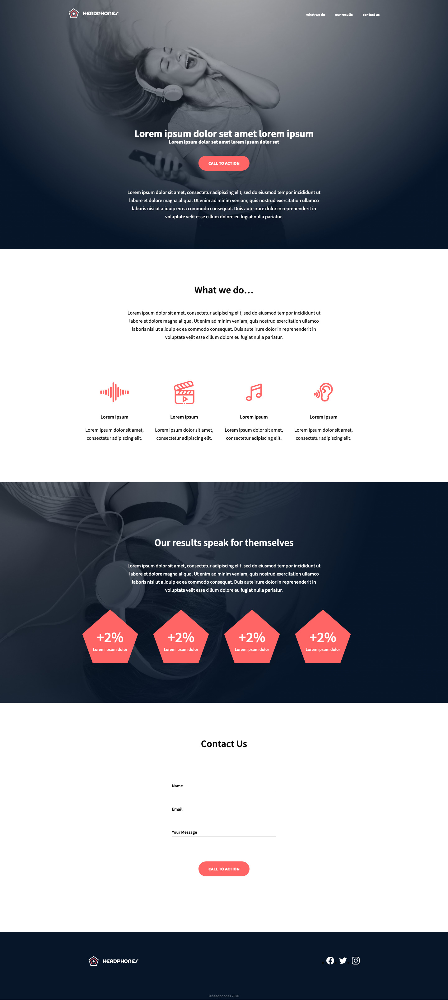
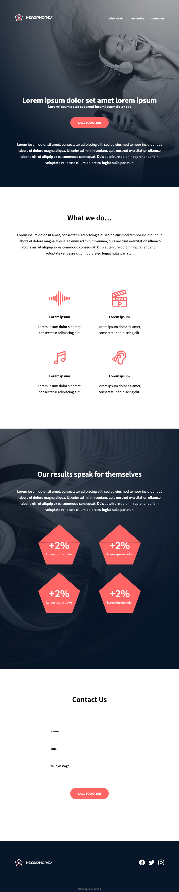
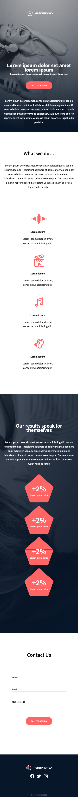

# Implement a design from scratch

the goal of this project is implement from scratch, without any library, a web page. using all HTML/CSS/Accessibility/Responsive design knowledge learned previously.

the objective is simple: Have a fully functional web page that looks the same as the designer file. which has been designed by Nicolas Philippot, UI/UX designer.

## Requirments
* you are not allowed to import external CSS framework (like Bootstrap)
* you are not to use Javascript

# End Product

## Desktop

## Responsive 

## Mobile
